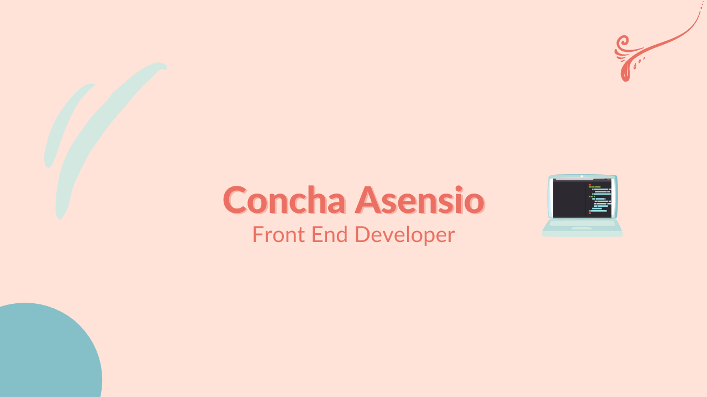

# Hi, I´m Concha Asensio! 👋

## I am a Front-End Developer 👩‍💻

Lawyer reinvented in Front-End developer. After several years of working surrounded by engineers within large tech companies, I decided that I wanted to be one of those people who build things and make it work.

As a judoka, I am a disciplined and methodical person and I always do my work with respect and empathy to my colleagues. Judo also gave me the love of learning and continuous improvement, which has made me keep growing both professionally and as a person in each ney challenge I face.

I am currently working at Codium as Jr. Front-End Developer.

### Something about me

In my free time I love reading good novels, watching TV shows, traveling and horse riding and motorbikes.

## Talks 🗣 
<table>
  <tr>
    <td align="center">
      <a href="https://www.youtube.com/watch?v=PSOA168SJJc&t=1349s">
        
         
        
          <b>Contratos de Desarrollo de Software - Adalaber Fest</b>
        
      </a>
       
    </td>
    <td align="center">
      <a href="https://www.youtube.com/watch?v=ReKlql7tOa8">
        
         
        
          <b>Mi experiencia reinventándome como desarrolladora</b>
        
      </a>
       
    </td>    
  </tr>
 </table>
 
 ## Panel
<table>
  <tr>
    <td align="center">
      <a href="https://youtu.be/wWum0qFiiEA?t=5972">
        
         
        
          <b>Mesa redonda: Mujeres en el sector tecnológico - AI Fest Spain</b>
        
      </a>
       
    </td>
    <td align="center">
      <a href="https://youtu.be/MiJXAksnRWA?t=18090">
        
         
        
          <b>Cómo entrar en comunidades tech y seguir teniendo vida - CodeNoobs</b>
        
      </a>
       
    </td>
  </tr>
 </table> 

### Contact

You can find me on Linkedin and Twitter. You can also send me an email, if you prefer.

<!--  -->

✉️ conchaasensiomr@gmail.com

<!--
**conchaasensio/conchaasensio** is a ✨ _special_ ✨ repository because its `README.md` (this file) appears on your GitHub profile.

Here are some ideas to get you started:

- 🔭 I’m currently working on ...
- 🌱 I’m currently learning ...
- 👯 I’m looking to collaborate on ...
- 🤔 I’m looking for help with ...
- 💬 Ask me about ...
- 📫 How to reach me: ...
- 😄 Pronouns: ...
- ⚡ Fun fact: ...
-->
